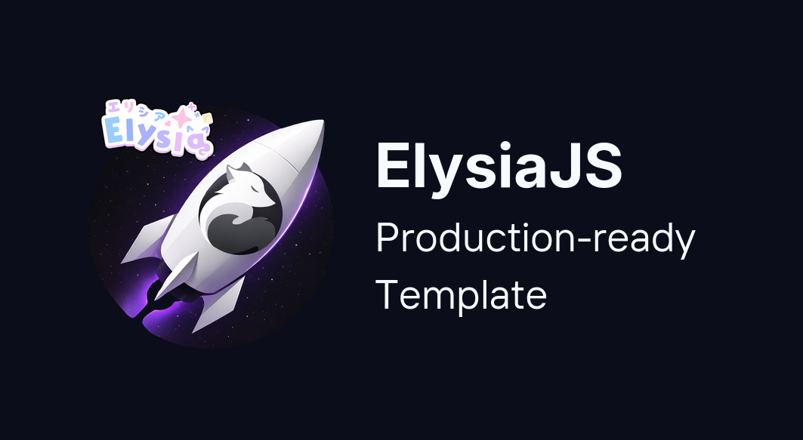

<h1 align="center">Elysia Production Boilerplate</h1>
<h3 align="center">
    A production-ready ElysiaJS starter for your projects, featuring<br>
    <b>Clean Architecture</b>, <b>Better Auth</b>, <b>Drizzle ORM</b>, and <b>OpenAPI</b> documentation.
</h3>
<p align="center">
    
</p>

<p align="center">
  <a href="https://elysiajs.com">
    
  </a>
  <a href="https://bun.sh">
    
  </a>
  <a href="https://better-auth.com">
    
  </a>
  <a href="https://orm.drizzle.team">
    
  </a>
  <a href="https://www.postgresql.org">
    
  </a>
</p>

<p align="center">
  <a href="https://github.com/techfusionid/elysia-production-template/actions/workflows/ci.yml">
    
  </a>
  
</p>

## Features

### What you get:

- 🚀 **Production-ready foundation** — Designed for both local development and production systems
- ⚡ **High-Performance Foundation** — Leverages Bun's async speed with Elysia.js for ultra-low latency.
- 🔐 **Built-in API security** — First-class support for protected and public endpoints
- 🔑 **Built-in Authentication** — Login, registration, & OTPs (Better Auth, toggleable)
- ✅ **Type-safe Validation** — Runtime + compile-time schemas with TypeBox
- 🗄️ **Database & Migrations** — PostgreSQL + Drizzle ORM with built-in migration handling
- 📖 **API Documentation** — OpenAPI rendered with Scalar UI at `/docs`
- 🚦 **Rate limiting** — Global and auth-aware traffic protection
- 📧 **Email Infrastructure** — Native Resend + React Email integration for notifications
- 📋 **Structured logging** — Pino with dev-friendly output
- ⚠️ **Error Handling** — Comprehensive error handling system
- 🧹 **Linting & formatting** — Biome for consistent code style
- 🐳 **Docker Ready** — One-command compose and production container setup

## Why use this starter?

**Elysia.js is fast.** It's currently the fastest framework in the Bun ecosystem, delivering industry-leading performance with outstanding throughput and ultra-low latency.

**The problem?** Setting up Authentication, ORM, Docker, and logging from scratch for a production-ready app takes hours.

This boilerplate provides a **simple, ready-to-use, production-grade foundation** so you can focus on building features immediately with Elysia, without redoing repetitive configuration and setup.

### Perfect if you want to:

- Build a production-ready API on Elysia.js without reinventing the same setup
- Start developing immediately with sensible defaults and clear structure
- Keep full control over configuration while avoiding boilerplate fatigue
- Use modern, type-safe tooling without framework lock-in

## Quick Start

**Clone the repo:**

```bash
git clone https://github.com/techfusionid/elysia-production-template.git
cd elysia-production-template
```

**Setup environment:**

```bash
cp .env.example .env
```

> [!IMPORTANT]
> Open `.env` and update `BETTER_AUTH_SECRET` and `DATABASE_URL` before running.

**Install & run:**

```bash
bun install
bun run dev
```

**Or with Docker:**

```bash
docker-compose up
```

Your app is now running:

- **API:** http://localhost:3000
- **Docs:** http://localhost:3000/docs
- **Health:** http://localhost:3000/health

## Project Structure

```
src/
├── common/
│   ├── config/       # Environment, auth, email settings
│   ├── db/           # Database connection & schema
│   ├── logger/       # Pino logger
│   └── middleware/   # Auth guard, rate limiter, request logger
├── modules/
│   ├── auth/         # Better Auth integration
│   ├── health/       # Health check endpoint
│   └── posts/        # Example CRUD module
├── app.ts            # App composition & middleware
└── index.ts          # Entry point

tests/                # Integration tests
```

## Configuration

Key environment variables (see `.env.example` for full list):

| Variable                     | Description                                                   | Required              |
| ---------------------------- | ------------------------------------------------------------- | --------------------- |
| `DATABASE_URL`               | PostgreSQL connection string                                  | Yes                   |
| `BETTER_AUTH_SECRET`         | Auth secret key (generate: `openssl rand -base64 32`)         | Yes                   |
| `BETTER_AUTH_URL`            | Base URL for auth callbacks                                   | Yes                   |
| `ENABLE_AUTH`                | Enable/disable auth module                                    | No (default: `true`)  |
| `REQUIRE_EMAIL_VERIFICATION` | Require email verification before login                       | No (default: `false`) |
| `ENABLE_RATE_LIMITER`        | Enable/disable rate limiting                                  | No (default: `true`)  |
| `LOG_LEVEL`                  | Log level: `fatal`, `error`, `warn`, `info`, `debug`, `trace` | No (default: `info`)  |
| `CORS_ORIGIN`                | Allowed origins (comma-separated)                             | No                    |

## Commands

**Common development and maintenance commands:**

**Development:**

```bash
bun run dev          # Start dev server with hot reload
bun run build        # Build for production
bun run start        # Start production server
```

**Testing:**

```bash
bun run test         # Run integration tests
```

> [!NOTE]
> Tests run against your local database. Make sure PostgreSQL is running before testing.

**Database:**

```bash
bun run db:generate  # Generate Drizzle migrations
bun run db:migrate   # Run migrations
bun run db:studio    # Open Drizzle Studio
```

**Linting:**

```bash
bun run lint         # Run Biome linter
bun run format       # Format code
```

**Docker:**

```bash
docker-compose up              # Start all services
docker-compose up --build      # Rebuild and start
docker-compose down            # Stop all services
```

## API Endpoints

Below are the main routes exposed by the template. See `/docs` for full request/response schemas.

**Auth routes** (via Better Auth):

| Method | Endpoint                    | Description            |
| ------ | --------------------------- | ---------------------- |
| POST   | `/api/auth/sign-up/email`   | Register               |
| POST   | `/api/auth/sign-in/email`   | Login                  |
| POST   | `/api/auth/sign-out`        | Logout                 |
| GET    | `/api/auth/get-session`     | Get current session    |
| POST   | `/api/auth/forgot-password` | Request password reset |
| POST   | `/api/auth/reset-password`  | Reset password         |

**Posts routes** (example CRUD):

| Method | Endpoint         | Description     | Auth  |
| ------ | ---------------- | --------------- | ----- |
| GET    | `/api/posts`     | List all posts  | No    |
| GET    | `/api/posts/:id` | Get single post | No    |
| POST   | `/api/posts`     | Create post     | Yes   |
| PUT    | `/api/posts/:id` | Update post     | Owner |
| DELETE | `/api/posts/:id` | Delete post     | Owner |

**Health:**

| Method | Endpoint  | Description                 |
| ------ | --------- | --------------------------- |
| GET    | `/health` | Health check with DB status |

> Full API documentation available at `/docs` when running.

## Customization

This template is designed to be configurable without hiding behavior. Below are common customization points.

### Disabling Authentication

To disable authentication, set `ENABLE_AUTH=false` in `.env`.
All auth routes and middleware will be automatically excluded.

If you want to **completely remove built-in auth** from your codebase:

1. Delete the `src/modules/auth/` folder
2. Remove the `src/common/config/auth.ts` file
3. (Optional) Clean up any route guards that use `auth: true` (e.g., in `posts` module)

> 💡 For most use cases, just setting `ENABLE_AUTH=false` is sufficient and safe.

### Email Verification

By default, email verification is disabled. To enable, set in `.env`:

```bash
REQUIRE_EMAIL_VERIFICATION=true
```

When enabled, users must verify their email before they can log in.

> [!TIP]
> In development, emails are logged to console (no provider needed). For production, set `RESEND_API_KEY` and `EMAIL_FROM` in `.env` to send real emails via [Resend](https://resend.com).

### Password Reset

Password reset works out of the box. In development, reset links are logged to console. For production, configure Resend (see above).

### Rate Limiting

Rate limiting is enabled by default. To disable (e.g., for testing):

```bash
ENABLE_RATE_LIMITER=false
```

Adjust rate limits via environment variables:

```bash
# Global rate limit
RATE_LIMIT_WINDOW_MS=60000    # 60 seconds
RATE_LIMIT_MAX=100            # 100 requests per window

# Auth-specific rate limit (stricter)
AUTH_RATE_LIMIT_WINDOW_MS=60000
AUTH_RATE_LIMIT_MAX=10
```

### Protected vs Public Routes

Use the `auth` route option to mark endpoints as protected:

```typescript
// Public route - anyone can access
.get("/", async () => { ... })

// Protected route - requires login
.post("/", async ({ user }) => { ... }, { auth: true })
```

### Custom Authorization

For additional checks beyond login (e.g., ownership, roles, permissions), add logic in the route handler. The `posts` module shows an ownership check example:

```typescript
.put("/:id", async ({ params, user, set }) => {
  const isOwner = await service.isPostOwner(params.id, user.id);

  if (!isOwner) {
    set.status = 403;
    return { error: "Forbidden", message: "Not allowed" };
  }

  // proceed...
}, { auth: true })
```

### Adding New Modules

The `posts` module is a reference CRUD implementation. To add a new module:

1. Create folder: `src/modules/your-module/`
2. Add `index.ts` (routes), `service.ts` (business logic), and optionally `schema.ts`
3. Register in `src/app.ts`:

```typescript
import { yourModule } from "@modules/your-module";
app.use(yourModule);
```

---

## FAQ

<details>
<summary><strong>Why Elysia.js?</strong></summary>

Elysia is currently the fastest Bun framework with excellent TypeScript support, end-to-end type safety, and a clean plugin architecture. Perfect for building production APIs without sacrificing developer experience.

</details>

<details>
<summary><strong>Can I use a different database?</strong></summary>

The template uses PostgreSQL with Drizzle ORM. Drizzle also supports MySQL and SQLite. Update the connection config and adjust schema types as needed.

</details>

<details>
<summary><strong>Is this production-ready?</strong></summary>

Yes. Includes rate limiting, structured logging, error handling, health checks, and Docker support. For production, ensure you:

- Use strong secrets
- Set up database backups
- Ensure HTTPS is handled by a reverse proxy or your hosting platform (nginx, Caddy, or managed TLS)
</details>

## Deployment

This template is container-ready and works well with most Docker-based platforms.

## Contributing

Thanks for your interest in contributing to **Elysia Production Template**!
Contributions of all kinds are welcome: bug fixes, improvements, documentation, and examples.

This project aims to stay **simple, production-focused, and easy to extend**, so we appreciate well-scoped and thoughtful contributions.

---

## How to contribute

1. Fork this repository
2. Create a new branch from `main`
3. Make your changes
4. Run linting and tests using `bun test`
5. Open a pull request with clear PR description of the changes

```bash
git checkout -b my-feature
```

## License

[MIT](LICENSE)
